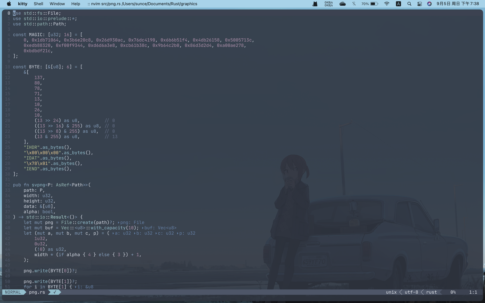
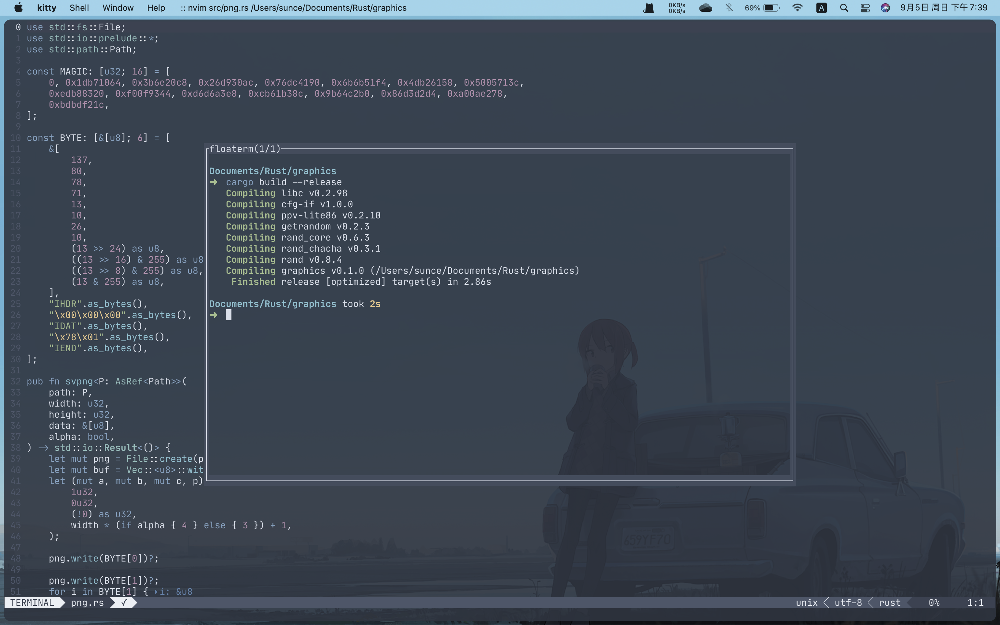
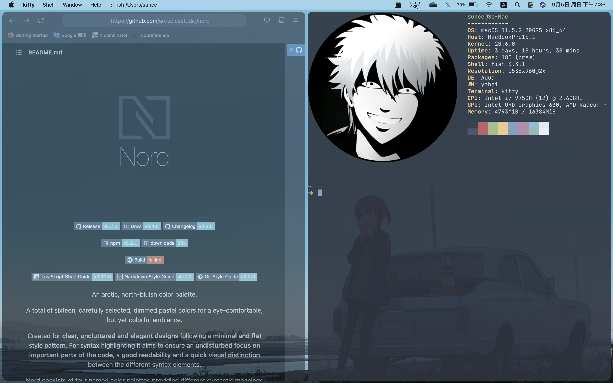

# dotfiles
My Mac config

## Specifications

* Terminal: [kitty](https://sw.kovidgoyal.net/kitty/)
* Colorscheme: [nord](https://github.com/arcticicestudio/nord)
* Shell: [fish](http://fishshell.com/)
* WM: [yabai](https://github.com/koekeishiya/yabai)
* Hotkey Daemon: [skhd](https://github.com/koekeishiya/skhd)
* Editor: [neovim](http://neovim.org/)
* File Manager: [ranger](https://ranger.github.io/)
* Shell Prompt: [starship](https://github.com/starship/starship)
* Browser: [firefox](https://www.firefox.com) (with nord theme)
* Firefox Theme: See [here](./chrome/)

## Neovim Config

See [here](./config/nvim/)

## Neovim Screenshots

## Screenshots

