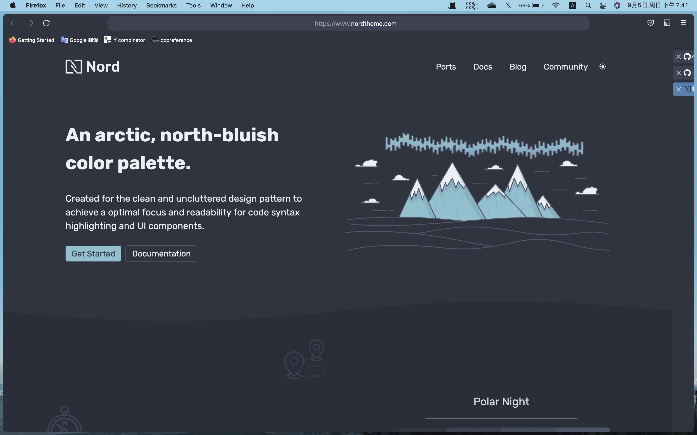

# Nord

This is my custom userChrome.css, inspired by [this](https://github.com/zjuyk/dotfiles/tree/master/private_dot_mozilla/private_firefox/private_6fcl58u3.default-release/chrome)

## Plugins

* [Tree Style Tab](http://piro.sakura.ne.jp/xul/_treestyletab.html.en)
* [Tabliss](https://tabliss.io/)

## Screenshot

